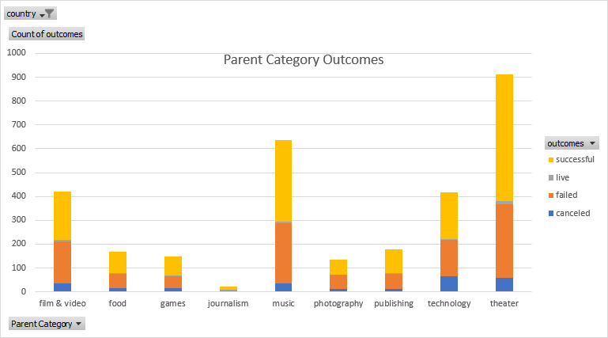

# An Analysis of Kickstarter Campaigns
Various metrics that are commonly associated with Kickstarter campaigns are analyzed in a variety of ways to support Louise in her dream of having a successful campaign for her play
---
## Overview of Kickstarter campaign outcomes by category
This chart gives a sense for where many campaign investments are placed as well as the rate of success, failed, cancelled, and ongoing campaigns 

---
## Kickstarter Outcomes Based on Launch Date
By analyzing the launch date of each campaign alongside the outcome, target launch months can be considered with confidence.

